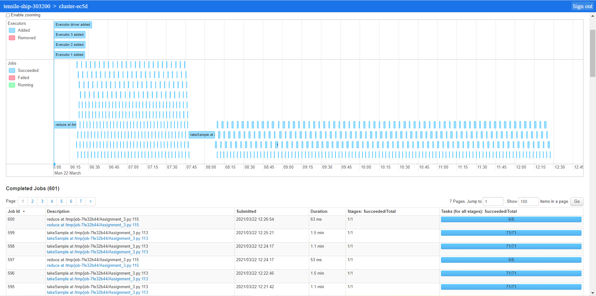
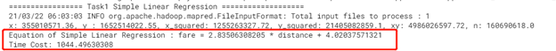
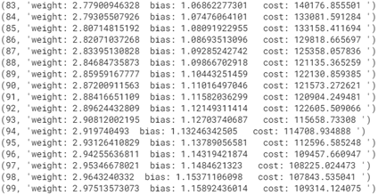

# PySpark Batch Gradient Descent

## Introduction

The goal of this assignment is to implement a set of Spark programs in python (using Apache Spark) to achieve Simple Linear
Regression Model and Multiple Linear Regression Model via Batch Gradient Descent method.
Specifically, this project analyzed a data set consisting of New York City Taxi trip reports in the
Year 2013. The dataset was released under the FOIL (The Freedom of Information Law) and made public
by Chris Whong 

``https://chriswhong.com/open-data/foil_nyc_taxi/``

``screen_shots`` contains spark history logs. and results of the each task.

``CS777_Assignment3_Kunfei.pdf`` is the written report of this assignment.

``CS777-aSSIGNMENT-3.pdf`` is the assignment introduction and requirement.

## Getting Started
To run the program, type the following line with the argument of input path: 

    python spark-submit Assignment_3.py -input_path

## Author
Ivan Chen
